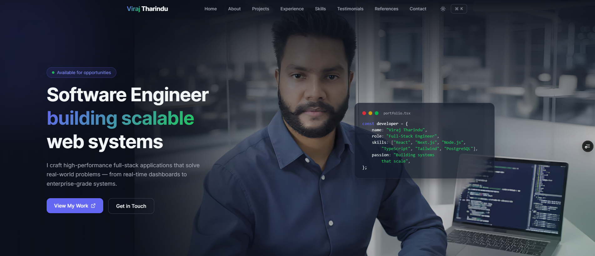
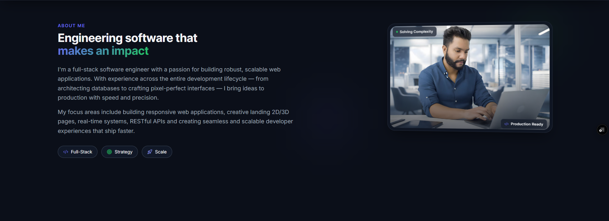
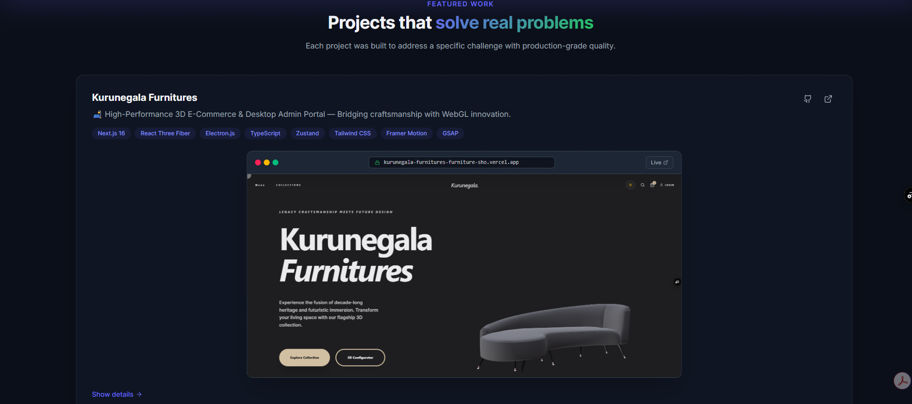
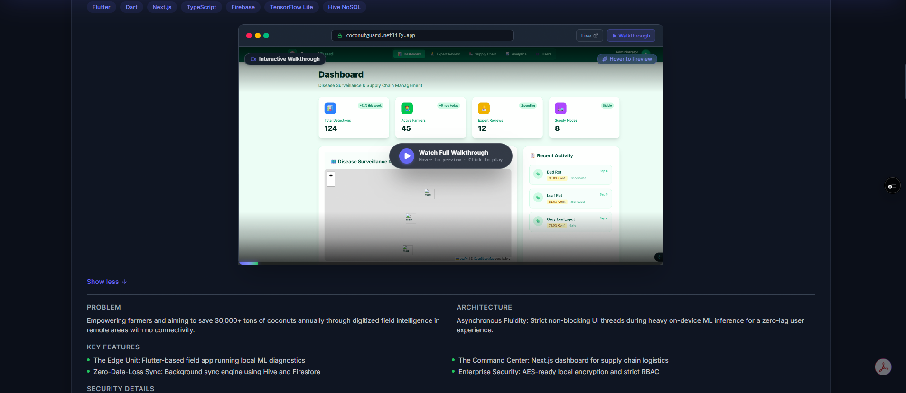
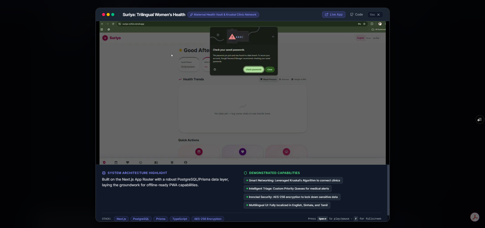
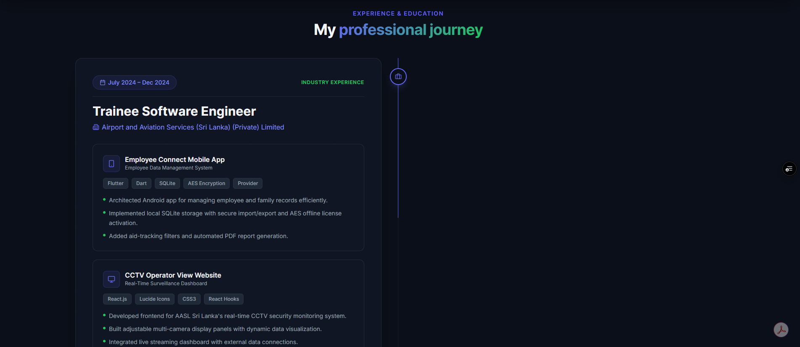
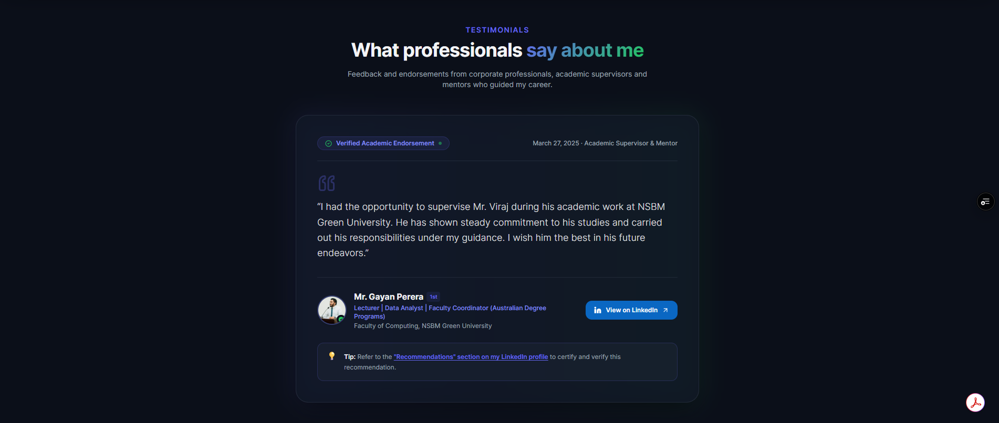
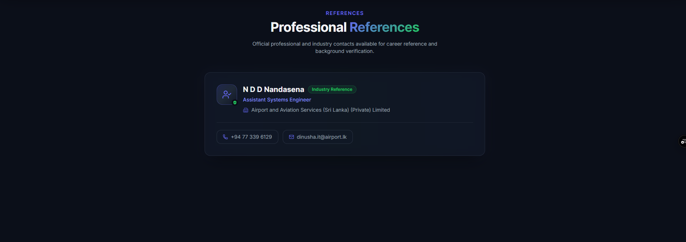
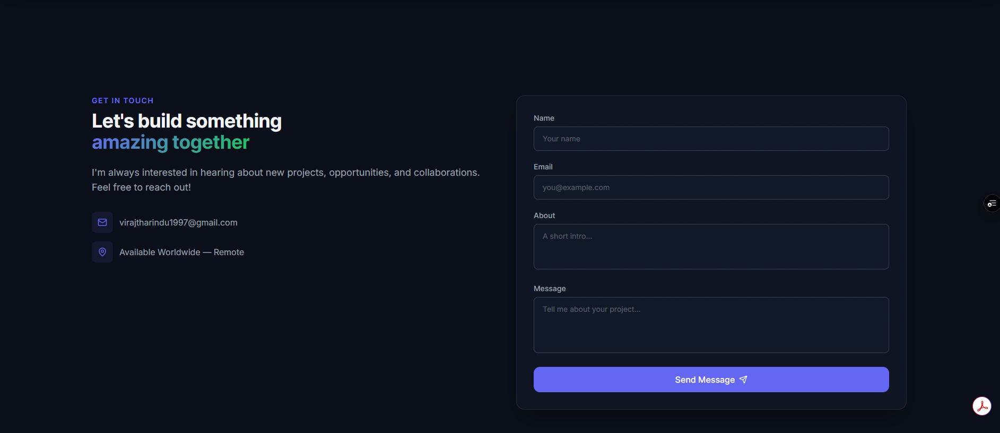

<div align="center">

# Viraj Tharindu · Portfolio

[](https://viraj-tharindu-portfolio-web-site.vercel.app/)
[](https://nextjs.org/)
[](https://www.typescriptlang.org/)
[](LICENSE)
[](LICENSE)

**A premium, open-source developer portfolio showcasing full-stack engineering excellence.**  
Built with Next.js 16, TypeScript, and modern UI patterns — deployed on Vercel.

🌐 **[Live Site → viraj-tharindu-portfolio-web-site.vercel.app](https://viraj-tharindu-portfolio-web-site.vercel.app/)**

</div>

---

## 📸 Screenshots

| # | Section | Preview |
|---|---------|---------|
| 1 | Hero |  |
| 2 | About Me |  |
| 3 | Projects – Card 1 |  |
| 4 | Projects – Card 2 |  |
| 5 | Projects – Card 3 |  |
| 6 | Experience |  |
| 7 | Skills & Tech Stack |  |
| 8 | Testimonials |  |
| 9 | References |  |
| 10 | Contact Us |  |

---

## ✨ Features

- 🎨 **Glassmorphism UI** – premium dark-mode aesthetic with gradient accents
- ⚡ **Server & Client Split** – static sections as Server Components, interactive parts dynamically imported
- 🎬 **Video Project Demos** – optimised `.mp4` demos embedded inline
- 🔍 **Command Palette** – keyboard-first navigation
- 📱 **Fully Responsive** – pixel-perfect on all screen sizes
- 🖼️ **Next.js Image Optimisation** – AVIF/WebP with configurable quality levels
- 🔒 **Security Headers** – CSP, X-Frame-Options, Referrer-Policy
- 📈 **SEO Ready** – semantic HTML, meta tags, canonical URLs

---

## 🗂️ Projects Showcased

| # | Project | Stack | Demo |
|---|---------|-------|------|
| 1 | **Kurunegala Furnitures** – 3D WebGL E-Commerce & Electron Admin | Next.js 16, R3F, Electron, Zustand, GSAP | [Live ↗](https://kurunegala-furnitures-furniture-sho.vercel.app/) |
| 2 | **CoconutGuard** – AI Agri-Tech (offline-first Flutter + Next.js) | Flutter, TensorFlow Lite, Firebase, Hive | [Live ↗](https://coconutguard.netlify.app/) |
| 3 | **Suriya** – Trilingual Women's Health Platform | Next.js, PostgreSQL, Prisma, AES-256 | [Live ↗](https://suriya-ochre.vercel.app/) |
| 4 | **RetailSphere** – Full-Stack ERP & PoS System | React 18, Node.js, MySQL, Zod, JWT | [Live ↗](https://retail-sphere-super-market-erp-syst.vercel.app/) |

---

## 🏗️ Architecture Overview

```
Viraj-Tharindu-Portfolio-Web-Site/
├── src/
│   ├── app/                  # Next.js App Router – pages & layout
│   ├── components/
│   │   ├── sections/         # Page sections (Hero, About, Projects …)
│   │   ├── ui/               # Reusable UI primitives
│   │   ├── Navbar.tsx
│   │   ├── Footer.tsx
│   │   ├── ThemeProvider.tsx
│   │   └── CommandPalette.tsx
│   └── data/
│       └── projects.ts       # Single source of truth for project data
├── public/                   # Static assets (videos, images, favicons)
├── docs/
│   ├── screenshots/          # Numbered section screenshots
│   ├── ENGINEERING.md
│   ├── DESIGN_DECISIONS.md
│   ├── DATABASE_SETUP.md
│   └── ROADMAP.md
├── next.config.ts
└── tsconfig.json
```

**Rendering Strategy:**

| Component type | Strategy | Benefit |
|---|---|---|
| About, Skills, Experience, Testimonials, References | Server Component | Zero JS shipped to client |
| Navbar, Hero, Projects, CommandPalette, Contact | `next/dynamic` + `ssr:false` | No hydration mismatch |

---

## 📦 Tech Stack

| Layer | Technology |
|-------|-----------|
| Framework | Next.js 16 (App Router, Turbopack) |
| Language | TypeScript 5 |
| Styling | Vanilla CSS + CSS Variables |
| Animation | CSS keyframes + transitions |
| Icons | Lucide React |
| Media | Next.js `<Image>` + `<video>` with optimised mp4 |
| Deployment | Vercel |

---

## 📋 Roadmap


| Feature | Status |
|---------|--------|
| Portfolio site launched | ✅ Done |
| All section screenshots added | ✅ Done |
| Video demos integrated & optimised | ✅ Done |
| Dark-mode theming | ✅ Done |
| Command Palette | ✅ Done |
| Security headers | ✅ Done |
| SEO meta tags | ✅ Done |
| Image quality optimisation [75,80] | ✅ Done |

---

## 📝 License

This project is open-source and available under the **MIT License**.  
See the [LICENSE](LICENSE) file for full terms.

© 2024 Viraj Tharindu. All rights reserved.

---

## 📬 Contact

| Channel | Link |
|---------|------|
| 🌐 Portfolio | [viraj-tharindu-portfolio-web-site.vercel.app](https://viraj-tharindu-portfolio-web-site.vercel.app/) |
| 💻 GitHub | [github.com/VirajTharindu](https://github.com/VirajTharindu) |
| 💼 LinkedIn | [linkedin.com/in/virajtharindu](https://www.linkedin.com/in/virajtharindu) |

---

<div align="center">
  <sub>Built with ❤️ by Viraj Tharindu</sub>
</div>
